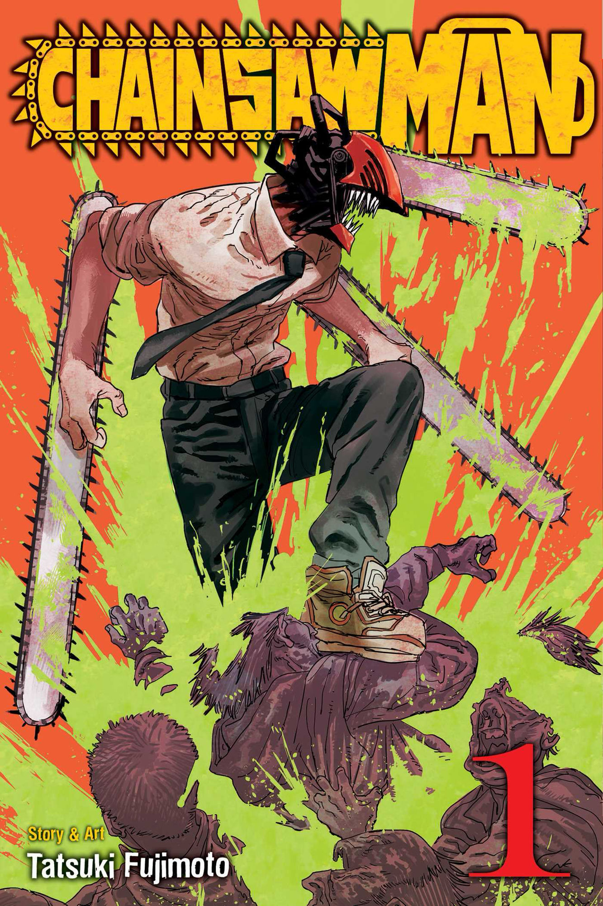

# Chainsaw Man

## Overview

A crude, but funny show with character design I appreciate. The idea of everyday fears powering 'devils' intrigued me. The main character is crass and lovable and the surrounding cast balances each other well. There is an overarching threat that is serious (except to the main character) and Denji's own personal goal in life that keeps the storyline entertaining. The contrast between the big threat and what he wants is an easy rhythm to follow. 

## Top 3 Moments

1. Pochita saving Denji: kicks off the series with an early heartbreaker. 
2. Denji, Aki, and Power becoming friends: found family trope, if you squint. 
3. Kobeni and the Eternity Devil: watching her descend into madness was fun, especially with Power's taunting.

## What Could Be Better

I easily get attached to characters, so when Himeno was taken out I was surprised, especially since she was in the intro. It did give Aki more scenes to reflect on, but his origin story seemed like enough of a driving force on its own, rather than killing her off. Also, I do enjoy the dynamic between Denji, Power, and Aki, but wished there were more scenes focusing on them. The scene with Denji and Aki where they get 'revenge' for Himeno was hilarious and great character building.  

## My Verdict

> Crass but funny show with epic fight scenes. 

### Final Score

**7/10**

## Related Reviews

Frieren hits harder emotionally. My Hero Academia has a similar group dynamic if that was the appeal.

- [[reviews/frieren | Frieren]]
- [[reviews/my-hero-academia | My Hero Academia]]
