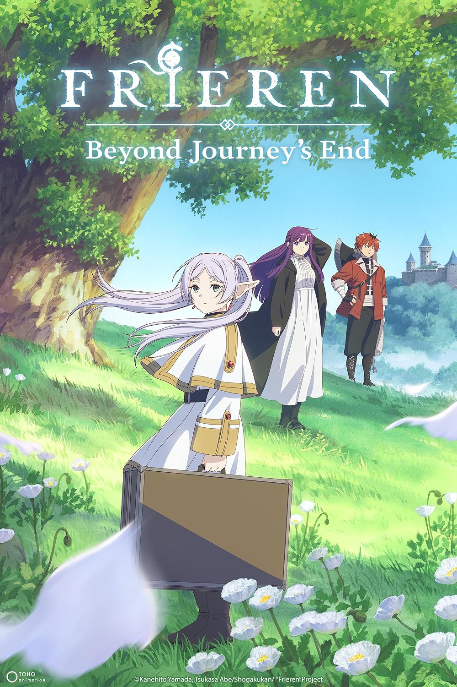

# Frieren: Beyond Journey's End

## Overview

A show about grief, growth, and friendship. Frieren is about an immortal who never realized how temporary life is for others. She didn't allow herself to ponder on how much time she had left with her hero group despite all their adventures. Since she lives so long, she ends up outliving the people she traveled with. After the hero Himmel dies, she realizes she never really got to know him or the others. The rest of the show follows her new journey with her apprentice Fern and the warrior Stark. Little by little, it shows you who Frieren is and how the people around her shaped her without her ever noticing. Her relationship with Himmel looms throughout the entire narrative as she goes through this journey. 

## What I Liked

- Emotional punches: Every episode has at least one. The quiet moments hit harder than the fights do, and none of it feels forced. You end up having to sit with it afterwards. 
- Character Development: You slowly learn who Frieren is. It shows how much the people around her impacted her, even when she didn't notice it herself. Despite her flippant attitude in the beginning about mortality, you still see her and connect with her. 
- The pacing: It's slow, but on purpose. It gives the emotional beats room to land.

## Standout Moment

Early in the series, Frieren and Fern go looking for a specific flower. They end up finding a statue of Himmel, and Frieren uses her magic to grow a whole field of those flowers around it. It's a small, quiet moment, but it shows how much Himmel still means to her even though she thought his insistence on having statues was silly at the time. 

## One-line Summary

> Emotional gut-punches. 

### Final Score

**10/10**

## Related Reviews

Chainsaw Man has the emotional hits and the found family angle. Solo Leveling is the opposite so it's simpler, but still a good watch.

- [[reviews/chainsaw-man | Chainsaw Man]]
- [[reviews/solo-leveling | Solo Leveling]]
