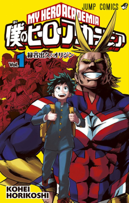

# My Hero Academia

## Overview

A superhero show where quirks (powers) are normal and heroes use theirs to fight against villains. The main character, Deku, is quirkless but manages to borrow some powers from his hero. The story focuses on him training and the situation him and his class get into while at school. 

## Ranking the Main Trio

1. Todoroki: he is funny in an unintentional way (on his part), but his journey with learning to accept both parts of himself from his parents was meaningful. 
2. Deku: in the beginning of the series, I found him to be annoying at times, but as he grew stronger, I started to come around. His impact on other characters is clear and inspiring. 
3. Bakugo: he is better toward the end of the series, but his repetitiveness wasn't as appealing to me. It took a long time for character development to kick in and by then, he didn't stand a chance against the other two. 

## What Could Be Better

Deku showing his power more around his classmates. He clearly has an impact on the people around him, but the show doesn't lean into those moments much. A few more scenes of him going all out in front of his class would have made a difference. 

## Memorable Quote

> _"Giving help that's not asked for... is what makes a true hero!"_ - Izuku "Deku" Midoriya

### Final Score

**7/10**

## Related Reviews

Spy x Family has stronger group dynamics if that was the appeal. Chainsaw Man has a similar vibe with the main trio.

- [[reviews/spy-x-family | Spy x Family]]
- [[reviews/chainsaw-man | Chainsaw Man]]
