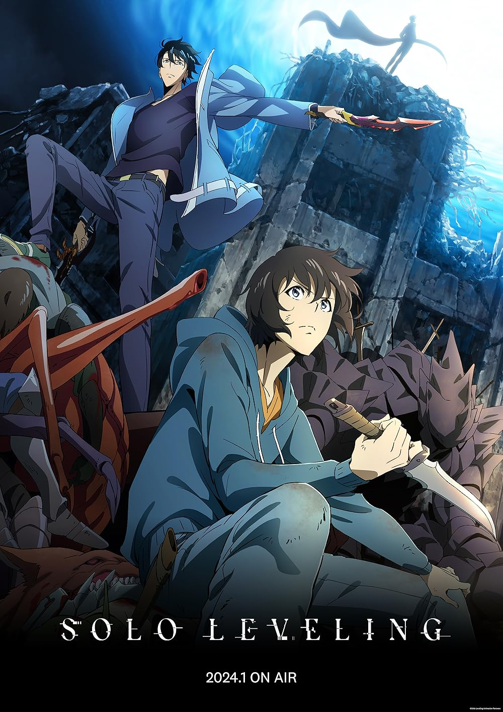

# Solo Leveling

## Overview

Overpowered main character with cool fight scenes. His grind to the top is satisfying to watch. There isn't much substance or personality. His only goal is getting stronger, but the show is entertaining still. 

## What I Liked

- Overpowered MC: watching him grind from the weakest hunter to the strongest is satisfying.
- One goal: he only cares about getting stronger, which keeps the story simple to follow.
- Fight scenes: they look cool and the wins feel earned.

## What Could Be Better

The show is entertaining and simple, but at times, it feels like the MC doesn't have any personality. The one that is shown to us at times isn't the best. The fact that he didn't go help others fight despite being the strongest because he didn't care was the most we got out of him. I like that he is strong and that he wins every fight, however, he is pretty one-dimensional because of it. There could be small character building moments happening even if it's in the background or one-off lines. It would be better than nothing. 

## My Verdict

> Get stronger. Win every fight. Rinse. Repeat. 

### Final Score

**8/10**

## Related Reviews

My Hero Academia has the same underdog-to-strongest arc. Spy x Family is just as easy to follow but with more going on character-wise.

- [[reviews/my-hero-academia | My Hero Academia]]
- [[reviews/spy-x-family | Spy x Family]]
