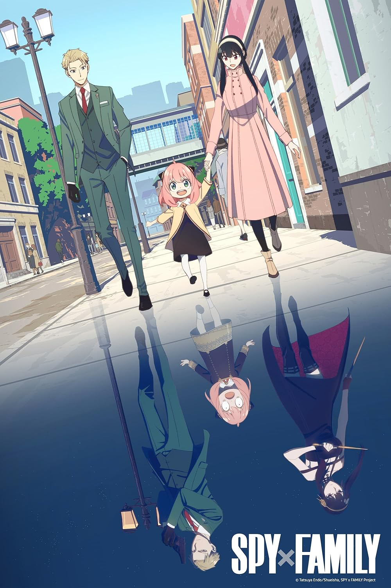

# Spy x Family

## Overview

A found family that was schemed from each family member. A spy, an assassin, a mindreader, and precognition / future seer end up playing the part of a loving family. They all have secret lives from each other, besides Anya, who knows what each of them are hiding. There is a looming threat about the war and also each of them hiding their secret. 

## What I Liked

- Comedy: The comedy isn't crude and balances its, at times silly animation, with the characters. The show isn't afraid to make any of the characters look silly without betraying who the character is. There may be a silly animation for the spy but he quickly recovers which doesn't break the illusion. They all equally contribute to the humor without it feeling like its forced or dumbing them down. 
- Found Family: This trope is one I always enjoy. It's what the plot is based on. However, it's more literal than what we usually see. They are forced into playing the role of a family rather than being one in a more abstract sense. It's clear they all care for each other, even if the majority of them don't believe they are actually one. 
- Storyline: The plot is easy to follow. The characters and animation can be silly or odd at times, but it's still grounded. The looming potential of war, being jailed for being a spy or assassin, or losing the only family you've known is carried with each episode. There is character development and progression without it being boring or too quick. 

## What Could Be Better

There isn't much I can complain about. The show delivers what I expect. The only thing I'd complain about is not having more episodes. 

## Best Duo

> Bond and Anya. Bond episodes are great because he only wants to keep his family and their attention. The two have a great dynamic that leads to fun scenarios. 

### Final Score

**8/10**

## Related Reviews

Frieren goes deeper on the found family side if you want more of that. Solo Leveling is a lighter watch but still entertaining.

- [[reviews/frieren | Frieren]]
- [[reviews/solo-leveling | Solo Leveling]]
